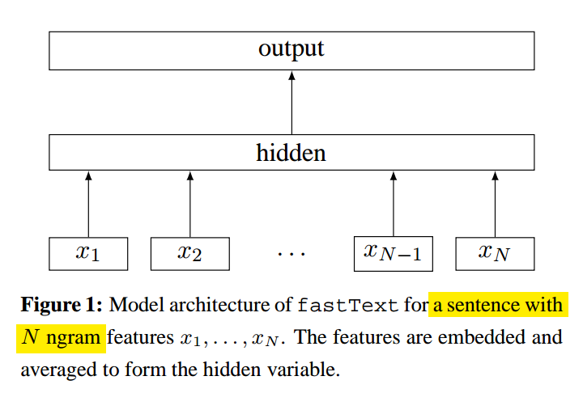
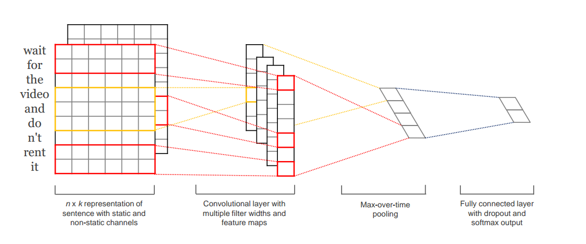
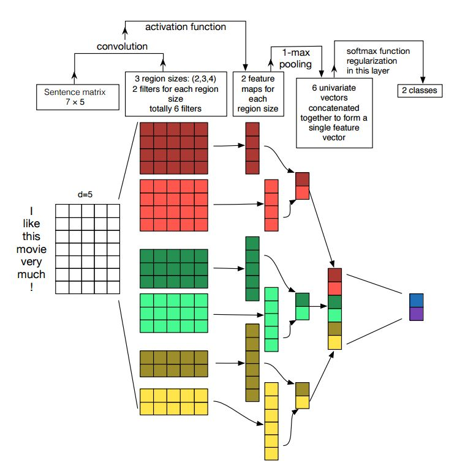
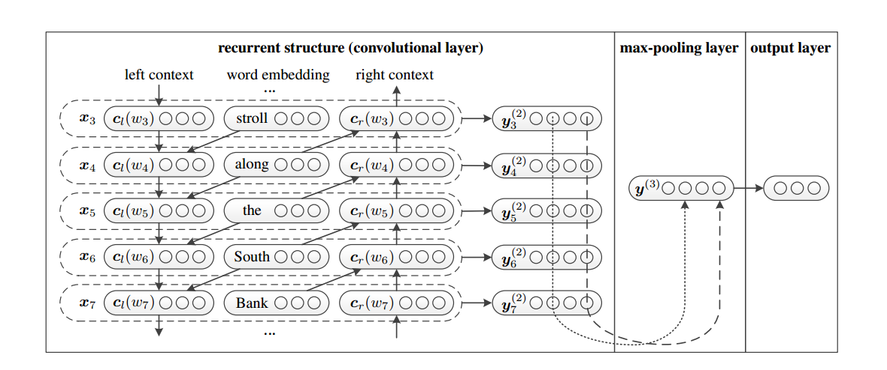
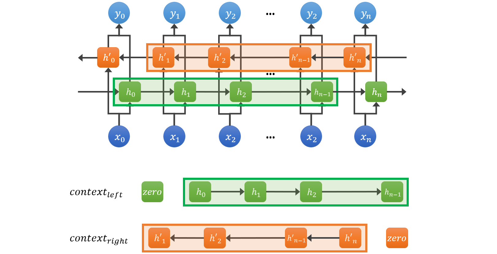

# text-classification
Simplified models for text classification by tensorflow.

### 1. fasttext
tensorflow implementation of "[Bag of Tricks for Efficient Text Classification, Armand Joulin, Edouard Grave, Piotr Bojanowski, Tomas Mikolov](https://arxiv.org/pdf/1607.01759.pdf)"

#### loss function:

$$\dfrac{1}{N}\sum_{n=1}^Ny_nlog(f(BAx_n))$$

- N is the number of documents
- $x_n$ is the normalized bag of features of the nth document. But in my_fasttext, I just use unigram.
- $y_n$ is the label
- A and B are the weight matrices.

#### Negative sample
When the number of classes is large, computing the linear classifier is computationally expensive. More precisely, the computational complexity is O(kh) where k is the number of classes and h the dimension of the text representation. In order to improve our running time, in our implementation we use negative sampling.

### 2. TextCNN
tensorflow implementation of "[Convolutional Neural Networks for Sentence Classification](http://www.aclweb.org/anthology/D14-1181)", and more information of configuration in "[A Sensitivity Analysis of (and Practitioners' Guide to) Convolutional Neural Networks for Sentence Classification](https://arxiv.org/abs/1510.03820)"

embedding -> conv -> max-pooling -> fully connected layer -> softmax

### 4. TextRCNN
tensorflow implementation of "[Recurrent Convolutional Neural Networks for Text Classification](http://scholar.google.com/scholar?q=Recurrent+Convolutional+Neural+Networks+for+Text+Classification&hl=zh-CN&as_sdt=0&as_vis=1&oi=scholart)"

The RecurrentNN is a biased model, where later words are more dominant than earlier words.  To tackle the bias problem, the Convolutional Neural Network (CNN), an unbiased model is introduced to NLP tasks,  which can fairly determine discriminative phrases in a text with a max-pooling layer.

#### Implementation of Recurrent Structure
The model is the enhanced version of rnn, it combines a word and its context to present a word. And then use an Convolutional layer (the filter_size is 1) to get the presentation of the word and its context.

- Bidirectional RNN (Bi-RNN) is used to implement the left and right context vectors.
- Each context vector is created by shifting the output of Bi-RNN and concatenating a zero state indicating the start of the context.

### reference

- [brightmart/text_classification](https://github.com/brightmart/text_classification)
- [roomylee/rcnn-text-classification](https://github.com/roomylee/rcnn-text-classification)
